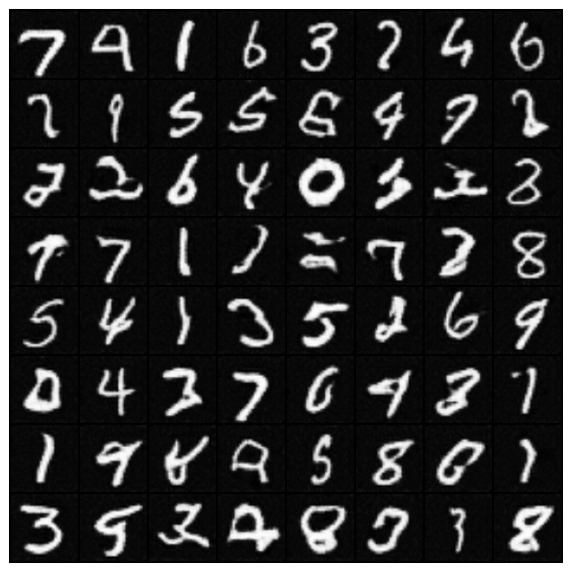
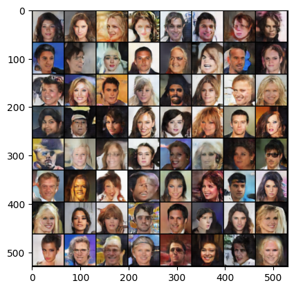

# Machine Learning Implementations

Custom machine learning implementations of various ML architectures for knowledge using only basic libraries(kind of).

Currently includes:
* Simple Linear Regression
* Fully Connected Neural Network
* Convolutional Neural Network (dynamic layers and activation function support)

Generative Adversarial Network (GAN) implementation with PyTorch (could be implemented with a few tweaks to the aforementioned CNN implementation, but this is much easier)

Examples:

MNIST:

CelebA (faces)

